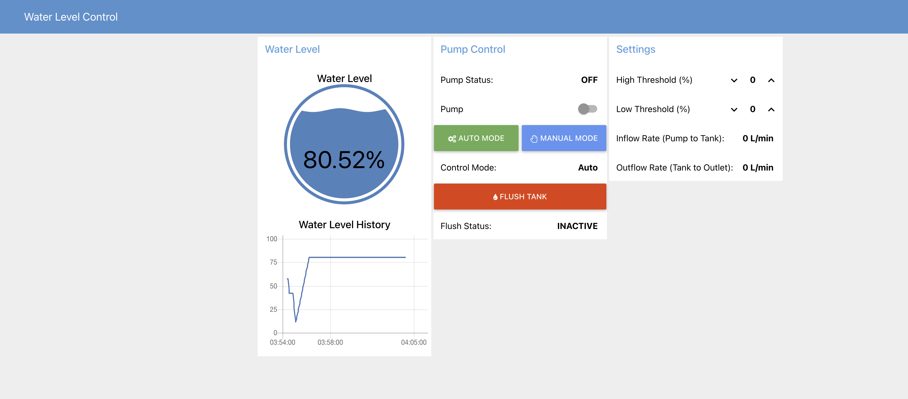
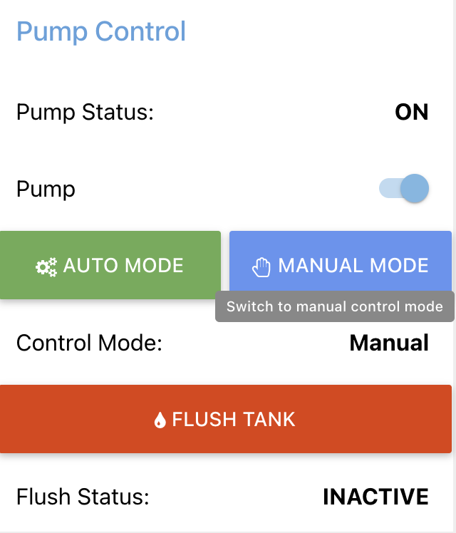
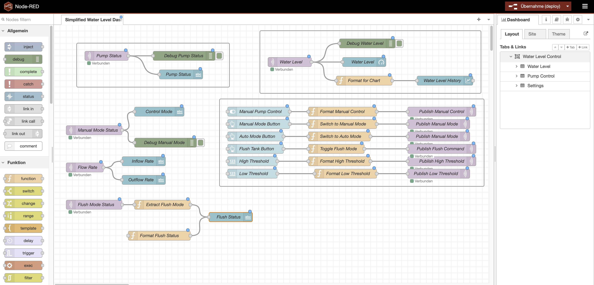
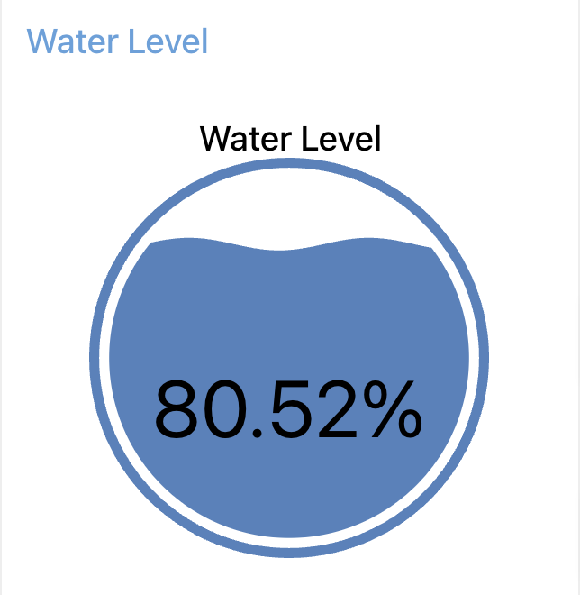
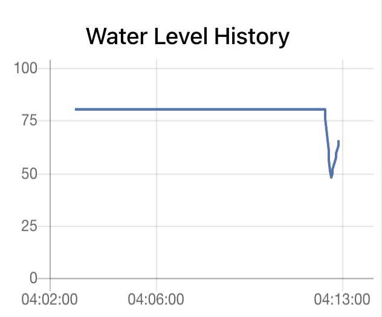

# Automated Water Level Control System (AWLC)

A system for monitoring water levels in a tank and automatically controlling a water pump based on threshold readings. The system uses MQTT for communication between components and provides a real-time dashboard for monitoring and control.



## Features

- Real-time water level monitoring with live gauge and historical charts
- Automatic pump control based on configurable thresholds
- Interactive web dashboard built with Node-RED
- Manual override capability for pump control
- Configurable high and low water level thresholds
- Flow rate monitoring (inflow and outflow)
- Flush tank functionality for quick draining
- Docker-based deployment for easy setup

## Quick Start

### Prerequisites

- Docker and Docker Compose installed on your system

### Installation and Setup

1. Clone the repository:
   ```bash
   git clone https://github.com/yourusername/AWTC.git
   cd AWTC
   ```

2. Start the system:
   ```bash
   cd docker
   docker compose up -d
   ```

3. Access the dashboard:
   - Dashboard UI: http://localhost:1880/ui
   - Node-RED Editor: http://localhost:1880

The system is now running and ready to use.

## System Architecture

```
┌─────────────────┐     MQTT      ┌─────────────────┐     MQTT      ┌─────────────────┐
│  Water Level    │  water/level  │  Pump           │  water/pump   │  Node-RED       │
│  Simulator      │───────────────▶  Controller     │───────────────▶  Dashboard      │
└─────────────────┘               └─────────────────┘               └─────────────────┘
        ▲                                                                     │
        │                                                                     │
        └─────────────────────── MQTT Commands ─────────────────────────────┘
```

## Project Structure

```
AWTC/
├── config/                           # Configuration files
│   ├── mosquitto.conf                # MQTT broker configuration
│   └── settings.js                   # Node-RED settings
├── docker/                           # Docker deployment files
│   ├── Dockerfile                    # Application container configuration
│   ├── docker-compose.yml            # Multi-container orchestration
│   └── docker-entrypoint.sh          # Container startup script
├── node-red/                         # Node-RED flows and configuration
│   ├── package.json                  # Node.js dependencies
│   └── flows/
│       └── simplified_water_level_dashboard.json
├── src/                              # Python source code
│   ├── water_level_server/           # Water level simulation module
│   │   └── water_level_simulator.py
│   └── middleware/                   # Middleware components
│       └── pump_controller.py        # Pump control logic
├── main.py                           # Main application entry point
├── requirements.txt                  # Python dependencies
└── README.md                         # Project documentation
```

## Docker Commands

### Basic Operations

Start the system:
```bash
docker compose up -d
```

Stop the system:
```bash
docker compose down
```

View logs:
```bash
docker compose logs -f
```

Restart the system:
```bash
docker compose restart
```

### Advanced Operations

Rebuild after code changes:
```bash
docker compose up --build -d
```

View specific container logs:
```bash
docker logs awlc
```

Check container status:
```bash
docker compose ps
```

Remove everything including volumes:
```bash
docker compose down -v
```

## Dashboard Overview

The Node-RED dashboard provides comprehensive monitoring and control capabilities:

### Water Level Display
- Real-time gauge showing current water level percentage
- Historical chart displaying water level trends over time

### Pump Controls
- Status indicator showing current pump state
- Manual control switch for pump override
- Auto/Manual mode selection
- Flush tank button for emergency draining

### System Settings
- High threshold configuration (default: 80%)
- Low threshold configuration (default: 20%)
- Flow rate display in liters per minute



## Configuration

### Port Configuration

The system uses the following ports:

| Port | Service | Description |
|------|---------|-------------|
| 1880 | Node-RED | Web interface and editor |
| 1884 | MQTT | MQTT broker (internal port 1883) |
| 9001 | WebSocket | MQTT WebSocket connection |

To modify port mappings, edit `docker/docker-compose.yml`:

```yaml
ports:
  - "1880:1880"  # Format: HOST_PORT:CONTAINER_PORT
  - "1884:1883"  # Change host port if needed
  - "9001:9001"
```

### Water Level Parameters

When running the Python application manually, the following command-line options are available:

```bash
python main.py \
  --broker localhost \
  --port 1883 \
  --tank-height 150 \
  --interval 1 \
  --high-threshold 80 \
  --low-threshold 20
```

| Parameter | Default | Description |
|-----------|---------|-------------|
| --broker | localhost | MQTT broker address |
| --port | 1883 | MQTT broker port |
| --tank-height | 100 | Tank height in centimeters |
| --interval | 2 | Update interval in seconds |
| --high-threshold | 80 | High water level threshold (%) |
| --low-threshold | 20 | Low water level threshold (%) |

## Manual Installation

If you prefer not to use Docker, follow these steps:

### 1. Install Dependencies

Install Python packages:
```bash
pip install -r requirements.txt
```

Install MQTT Broker:
```bash
# macOS
brew install mosquitto

# Ubuntu/Debian
sudo apt-get install mosquitto

# Windows
# Download from https://mosquitto.org/download/
```

Install Node-RED:
```bash
npm install -g node-red
cd ~/.node-red
npm install node-red-dashboard
```

### 2. Start Components

Start MQTT Broker:
```bash
mosquitto -c config/mosquitto.conf
```

Start Node-RED:
```bash
node-red --settings config/settings.js
```

Import Dashboard Flow:
1. Open http://localhost:1880
2. Click the menu (top right) and select Import
3. Select the file `node-red/flows/simplified_water_level_dashboard.json`
4. Click Deploy

Start Water Level System:
```bash
python main.py --broker localhost
```

## Troubleshooting

### Dashboard Not Loading

**Problem:** Dashboard shows blank page or errors

**Solution:**
```bash
# Check if containers are running
docker compose ps

# Check logs for errors
docker compose logs

# Restart the system
docker compose restart
```

### MQTT Connection Issues

**Problem:** No data appearing on dashboard

**Solution:**
```bash
# Check MQTT broker status
docker compose logs mosquitto

# Verify MQTT connectivity
docker compose exec awlc python -c "import paho.mqtt.client as mqtt; print('MQTT OK')"

# Restart services
docker compose restart
```

### Port Already in Use

**Problem:** Error message "port is already allocated"

**Solution:**

Find what is using the port:
```bash
# macOS/Linux
lsof -i :1880

# Windows
netstat -ano | findstr :1880
```

Either stop the conflicting service or change the port in `docker/docker-compose.yml`.

### Dashboard Components Missing

**Problem:** UI shows "unknown" elements or missing components

**Solution:**
```bash
# Rebuild with fresh installation
docker compose down
docker compose up --build -d
```

### Container Keeps Restarting

**Problem:** Container status shows constant restarting

**Solution:**
```bash
# Check detailed error logs
docker logs awlc --tail 100

# Common causes:
# - Missing Python dependencies: Verify requirements.txt
# - Port conflicts: Check docker-compose.yml port mappings
# - Permission issues: Verify volume mount permissions
```

## System Requirements

### Docker Deployment (Recommended)
- Docker Engine 20.10.0 or higher
- Docker Compose V2
- Minimum 1GB RAM
- 2GB free disk space

### Manual Installation
- Python 3.8 or higher
- Node.js 16.0 or higher
- MQTT Broker (Mosquitto 2.0+)
- npm 8.0 or higher

## Recent Updates

**November 15, 2023**
- Fixed Node-RED dashboard installation in Docker container
- Added proper MQTT broker configuration
- Improved Python script execution in docker-entrypoint.sh
- Enhanced settings.js for dashboard UI functionality
- Added persistent data volumes
- Added flush tank functionality
- Disabled automatic water draining for better manual control

## Screenshots

### Main Dashboard View


### Node-RED Editor


### Water Level Gauge


### Historical Charts


## Technical Details

### MQTT Topics

The system uses the following MQTT topics:

- `water/level` - Current water level readings
- `water/pump` - Pump status and commands
- `water/control/mode` - Control mode (auto/manual)
- `water/thresholds` - Threshold configuration
- `water/flush` - Flush tank command

### Component Communication

1. Water Level Simulator publishes level readings to `water/level`
2. Pump Controller subscribes to `water/level` and publishes to `water/pump`
3. Node-RED dashboard subscribes to all topics for display
4. Dashboard publishes commands for manual control

## Contributing

Contributions are welcome. Please submit pull requests or open issues for bug reports and feature requests.

## License

This project is licensed under the MIT License. See the LICENSE file for details.

## Support

For issues and questions:

1. Check the Troubleshooting section above
2. Review Docker logs: `docker compose logs`
3. Open an issue on GitHub with:
   - Problem description
   - Log output
   - System information (OS, Docker version)

---

Automated Water Level Control System - IoT Project
